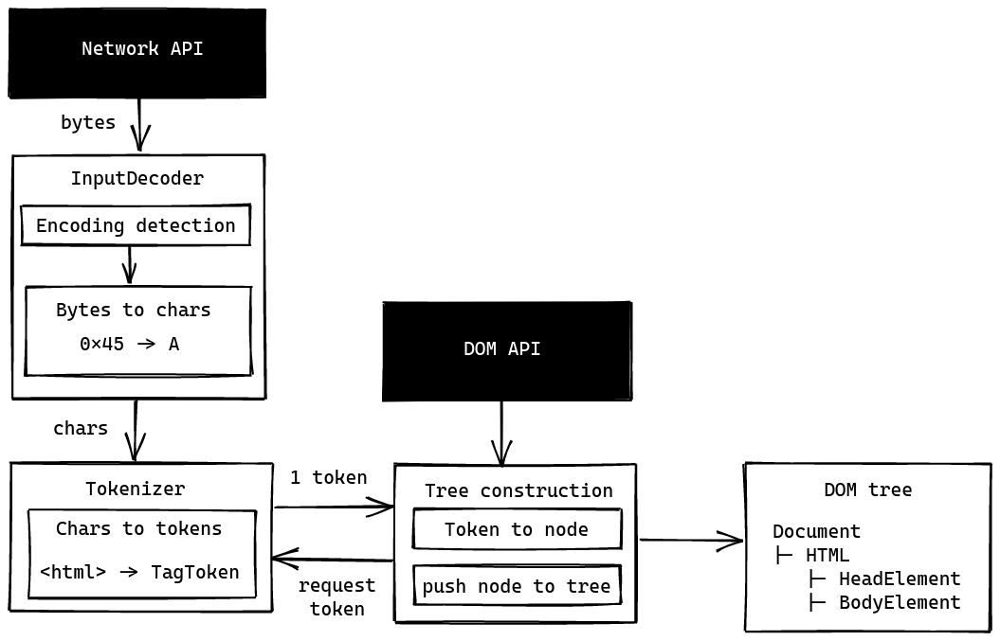

# HTML Parser

Parsing HTML is a process of transforming a stream of characters into a [DOM tree][1], which is a tree data structure with each node represent a part of the document.

## HTML parsing flow
The overall flow going from receiving bytes from network API to producing DOM tree is visualized below:

## Bytes stream decoding & Encoding detecting
Normally, the stream of characters that get input into the HTML parser comes from the the network. At this stage, the HTML document are just a bunch of bytes. These bytes will be decoded into characters with the appropriate encoding. 

To figure out what type of encoding that the document is written in, a encoding detecting algorithm is used to detect any encoding specified in the document. For example, reading encoding from the `<meta charset>` tag, etc.

## Tokenizing
The stream of decoded characters then feed into the tokenizer to transform into tokens. These tokens includes:

- `DOCTYPE`
- `start tag`
- `end tag`
- `comment`
- `character`
- `end-of-file`

Instead of performing tokenization for the whole document before passing the tokens onto the next stage for DOM tree construction. Each token that the tokenizer detect will have to be passed to the tree constructor. This way, if the tree constructor detected a piece of JavaScript, it will pause the whole process of parsing HTML and execute the script first.

The reason why JavaScript or CSS can block the parsing process is because JavaScript might modify the DOM tree structure. When JavaScript run, it can request for access to the CSSOM which depends on the CSS thus, **the CSS will block the execution of JS until all the CSS is loaded and the CSSOM is constructed.**

### Tokenizer
Tokenizer is a state machine that can produce one or more tokens when being requested for output. Since the DOM tree constructor decide if the tokenizer should continue parsing or pausing, the tokenizer should only run if being requested by the DOM tree constructor, instead of running independenly and pass or the tokens that it found to the DOM tree builder.

## DOM Tree construction
When the tokenizer emit a new token, it's processed by the DOM tree constructor to create a tree of DOM nodes using the received tokens. If the tokenizer said it received a script, the DOM tree construction stage will be paused/blocked until the JavaScript code execution is finished. After all resources has been fetched, CSSOM is constructed and all JavaScript is executed, the DOM tree will be returned and ready for rendering.

## Read more
- [Building the DOM faster: speculative parsing, async, defer and preload][2]
- [Adding Interactivity with JavaScript][3]

[1]: https://en.wikipedia.org/wiki/Document_Object_Model
[2]: https://hacks.mozilla.org/2017/09/building-the-dom-faster-speculative-parsing-async-defer-and-preload/
[3]: https://developers.google.com/web/fundamentals/performance/critical-rendering-path/adding-interactivity-with-javascript
